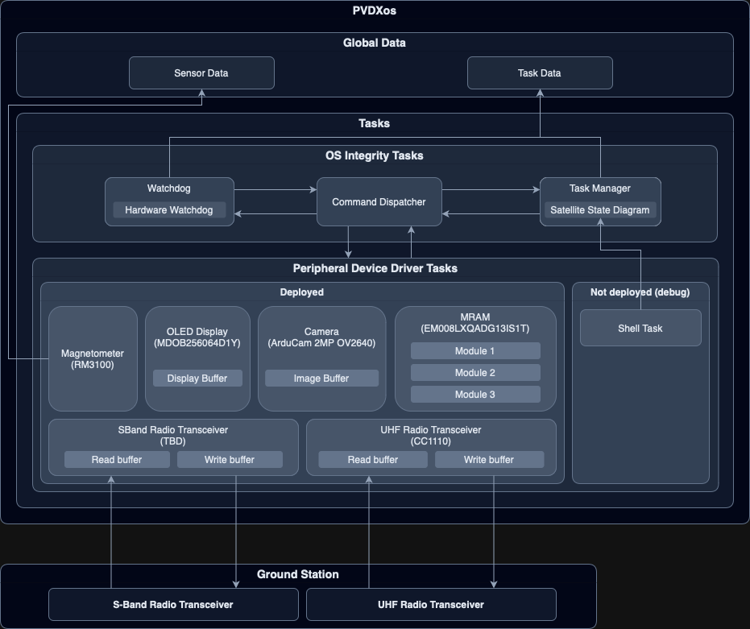

# PVDXos

The real-time operating system for Brown Space Engineering's second satellite, Perovskite Visuals and Degredation eXperiment (PVDX).



# Project Setup and Toolchain Installation Guide

## Building and Running:

> **Note:** If you're using a factory-new devboard that you've just unboxed, please follow [these instructions](#setting-up-a-brand-new-metro-m4-grand-central-devboard) first before continuing. If you've received a working devboard from another team member, you can continue.

### Windows

#### Pre-Build Setup: 

Some setup needs to be done when building for the first time. 

We need to pipe the USB connection to the J-link debugger into WSL

   1. In an administrator-level PowerShell, run `usbipd list`. The output should look like: 
   ```BUSID  VID:PID    DEVICE                                                        STATE
      1-1    1366:1020  J-Link                                                        Not shared
      1-2    0000:0002  Unknown USB Device (Device Descriptor Request Failed)         Not shared
      1-4    27c6:6594  Goodix MOC Fingerprint                                        Not shared
      2-1    0e8d:e025  MediaTek Bluetooth Adapter                                    Not shared
      5-1    174f:11b4  Integrated Camera, Integrated IR Camera, APP Mode             Not shared```
   2. In the same PowerShell, run `usbipd bind --busid <J-link busid>`. For example, if the output of
      list were as above, we would run `usbipd bind --busid 1-1` 
   3. And finally run `usbipd attach --wsl --busid <J-link busid>`. 
   
You should now be able to access the J-link over USB in WSL. You can verify this by running `lsusb` in your 
WSL terminal. The output should include a line like `Bus 001 Device 003: ID 1366:1020 SEGGER J-Link` 

#### Building. 

Before building, make sure you have completed all steps in the Pre-Build Setup. 

1. \[WIN\] Attach your J-Link to WSL by running `usbipd attach --wsl --busid <J-link busid>` in an 
administrator-level PowerShell

2. \[WSL\] In a WSL terminal, start a J-Link GDB server: 

   - `JLinkGDBServer -select USB=0 -device ATSAMD51P20A -endian little -if SWD -speed 4000 -noir -noLocalhostOnly -nologtofile -port 2331 -SWOPort 2332 -TelnetPort 2333`

3. \[WSL\] In a separate WSL terminal, run `make clean all` to delete the previous executable and compile a new version. 

4. \[WSL\] In the same terminal as step 3, connect to the GDB server by running `make connect`. 

   The code will automatically pause at the top of the 'main' function. Set any breakpoints you need, and then continue running the program with 'c'. 

5. \[WSL\] 


### Mac/Linux

1. **Start the SEGGER GDB Server:**

   - run `JLinkGDBServer` from the SEGGER folder containing all the J-Link tools.
   - Before clicking 'OK', make sure the target is set to `ATSAMD51P20A`, and the interface is set to `SWD`
   - WINDOWS/WSL ONLY: The "Localhost Only" checkbox must be unchecked.
   - Ensure the J-Link server is on port 2331 for GDB connections.

2. **Build, Connect and Run:**
   - Use `make clean all connect` to build the project, connect to the board and auto-flash/run the program. If you just want to connect without re-building, run `make connect`. If you just wish to build, run `make clean all`.
   - The code will automatically pause at the top of the 'main' function. Set any breakpoints you need, and then continue running the program with 'c'
   - To connect to the PVDXos Shell, use Telnet to establish a connection to localhost:19021. `nc localhost 19021` to connect with netcat on a Mac/Linux terminal
   - If using PuTTY, go to 'Terminal' and check the box for 'Implicit CR in every LF' so that line endings work correctly
   - Log output can be viewed by running `python3 scripts/rtt_logs.py` in a separate terminal window. This will also record logs to the `/logs` folder.
   - If the script fails to run, you may need to install 'pylink-square' (`pip install pylink-square`)
   - Alternatively, you can try running `python3 scripts/rtt_splitscreen.py` for both the PVDXos Shell and log output in the same terminal window, but this might not work!

## Toolchain Installation

### Windows

PVDXos uses GCC (GNU C Compiler) to create an executable. GCC can't be ported to Windows, so we need to virtualise a Linux environment 
for our toolchain. The standard solution is to use WSL (Windows Subsystem for Linux). 

As such, each instruction needs to be executed either in a Windows environment, or in the virtualised Linux environment. Each of the 
following steps is thus prepended either by \[WIN\] or \[WSL\] to indicate which environment to run it in. 

1. \[WIN\] Install Windows Subsystem for Linux (WSL):

   - Run `wsl --install` in PowerShell (as Administrator).
   - Follow prompts and restart your computer as required.

2. \[WSL\] Clone the repository into the WSL filesystem. This is important for performance during compilation.

3. \[WSL\] Install ARM toolchain for Linux:

   - `sudo apt install gcc-arm-none-eabi`

4. \[WSL\] Install GDB Multiarch and other build tools:

   - `sudo apt install gdb-multiarch`
   - `sudo apt install build-essential`
   - `sudo apt install clang-format`
   - `sudo apt install usbutils`

5. \[WIN\] Install [`usbipd`](https://github.com/dorssel/usbipd-win/releases) to pass USB connections through to WSL

6. \[WIN\] Download the 64-bit DEB SEGGER [J-link installer](https://www.segger.com/downloads/jlink/). 

   Once you've downloaded the installer, move it from your Windows Downloads folder to your WSL home directory.  

7. \[WSL\] Install the SEGGER J-Link tools from the command-line: 
   
   - `sudo apt install /path/to/j-link/installer`

8. \[WSL\] Add the installed J-link tools to your default `PATH`: 

   - Run `nano ~/.bash_profile`
   - Add the line `export PATH="$PATH:/opt/SEGGER/JLink"` at the bottom of the file

9. (Optional) Configure VSCode to use clang-format for formatting:

   - Install the `clang-format` extension in VSCode.
   - In VSCode properties, set the default formatter to `clang-format`.
   - Enable 'format on save' in the settings.
   - Set 'format on save mode' to 'modifications'.

### Mac/Linux (Geared towards Mac)

1. Download Segger's J-Link tools from [here](https://www.segger.com/downloads/jlink/).

> **Note:** Skip to step 6 if you have a Mac with an Intel processor.

2. Edit the `~/.zshrc` file:

   - You can use `nano ~/.zshrc` to edit this file. Use `CTRL`+`X`, then `Y`, then `Enter` to quit and save.
   - Add these lines to the bottom of the file:
     ```bash
     alias arm="env /usr/bin/arch -arm64 /bin/zsh --login"
     alias intel="env /usr/bin/arch -x86_64 /bin/zsh --login"
     ```

3. Run `source ~/.zshrc`.

   - This should enable the `arm` and `intel` commands in your terminal. Test this out by running `intel` and checking that the result of running `arch` is `i386`. Then run `arm` and check that the result of `arch` is `arm64`.

4. Switch into an intel terminal by running the `intel` command you just created, and verify that the `arch` command returns `i386`

5. Install brew in the intel terminal by running the script at https://brew.sh/ and following the prompts

   - > **Note:** After the Brew installation is complete, it will prompt you to run two other commands. Remember to copy/paste them into the terminal and run these as well.

6. Install gdb:

   - `brew install gdb`

7. Download Arm Developer Tools:

   - Download & Install the .pkg from [here](<https://developer.arm.com/downloads/-/arm-gnu-toolchain-downloads#:~:text=macOS%20(Apple%20silicon)%20hosted%20cross%20toolchains>).
   - Make sure you're downloading for the right hardware.

8. Add the Arm Developer Tools to your path by adding the following line to the bottom of the `~/.zshrc` (or `~/.bash_profile`) file, similar to step 1

   - Add:
     ```bash
     export PATH="/Applications/ArmGNUToolchain/<VersionNumber>/arm-none-eabi/bin/:$PATH"
     ```
   - IMPORTANT: Remember to replace `<VersionNumber>` with the version number of the toolchain you downloaded. It should be something like '13.2.Rel1'

9. Install other build tools:

   - `brew install gnu-sed` (if on mac)
   - `brew install clang-format`

10. (Optional) Configure VSCode to use clang-format for formatting:

   - Install the `clang-format` extension in VSCode.
   - In VSCode properties, set the default formatter to `clang-format`.
   - Enable 'format on save' in the settings.
   - Set 'format on save mode' to 'modifications'.

---

## Setting Up a Brand New Metro M4 Grand Central Devboard

The Grand Central runs on an Atmel SAMD51P20A, which has a `BOOTPROT` fuse protecting the flash area of the bootloader. If you have a factory-new board, you will need to clear the `BOOTPROT` fuse to allow your J-Link to flash code onto the board.

1. Install and open [Microchip Studio](https://www.microchip.com/en-us/tools-resources/develop/microchip-studio).
   > **Note:** Microchip Studio only supports Windows, so you might have to use a friend's computer for this, or in the worst case, install a Windows VM.
2. Connect your M4 Grand Central and J-Link to your computer via USB (and make sure they're connected to each other).
3. In Microchip Studio, go to `Tools > Device Programming`.
   - In the dialog that opens, select `Tool > J-Link`, `Device > ATSAMD51P20`, and `Interface > SWD`. Click `Apply`.
   - Click `Read`. The empty fields for _'Device Signature'_ and _'Target Voltage'_ will populate.
4. In the same 'Device Programming' window, select `Fuses`.
   - Change the value of `USER_WORD_0.NVMCTRL_BOOTPROT` to `0x0F` or `0 kbytes` (whichever shows up).
   - At the bottom of the window, click `Program` and then `Verify` to make sure the fuse has been set correctly.

That should be it. The J-Link GDB Server should now work as expected. Congrats on setting up your brand-new devboard!

---

## Adding a New File to the Project

> **Note:** This does not apply to .h files (although, you should still follow step 1)

1. Take 30 full seconds to think about the scope and name of this file:

   - Does the name encompass everything the file _could end up_ doing?
   - Is there a distinct logical separation between the role of this file and any other files?
   - Does it follow existing naming conventions (within the folder, and within the project)?
   - Does it belong in the folder you are adding it to? Will the file _always_ be doing things within this category?

2. Modify the `Makefile` to add the new file to the list of objects to be compiled:

   - Add the file's name to the OBJS list, with the .o extension instead of .c
   - If the file is in a new folder, add the newly created folder to the EXTRA_VPATH list as well

3. If anything gives you trouble, run a quick `make clean` to clear out any old object files

---

## How to Update the ASF Library:

1. Go to [Atmel Start](https://start.atmel.com/) and use the `atmel_start_config.atstart` file in the root of this repository to import the project.
2. Make any desired changes.
3. Export the project with the Makefile box checked, and the name ASF.
   - This will result in a file named `ASF.atzip`. Do not change this name.
4. Place the `ASF.atzip` file in the root of this repository.
5. To update the ASF library, run `cd src` and then `make update_asf`. This will completely wipe the ASF folder, so be careful!
   - Because of this, you should not put anything in the ASF folder that is not autogenerated by Atmel Start.
6. Ideally, there should be nothing to be done after `make update_asf` completes. Make sure you return to the top level of the project before trying to rebuild it. 
