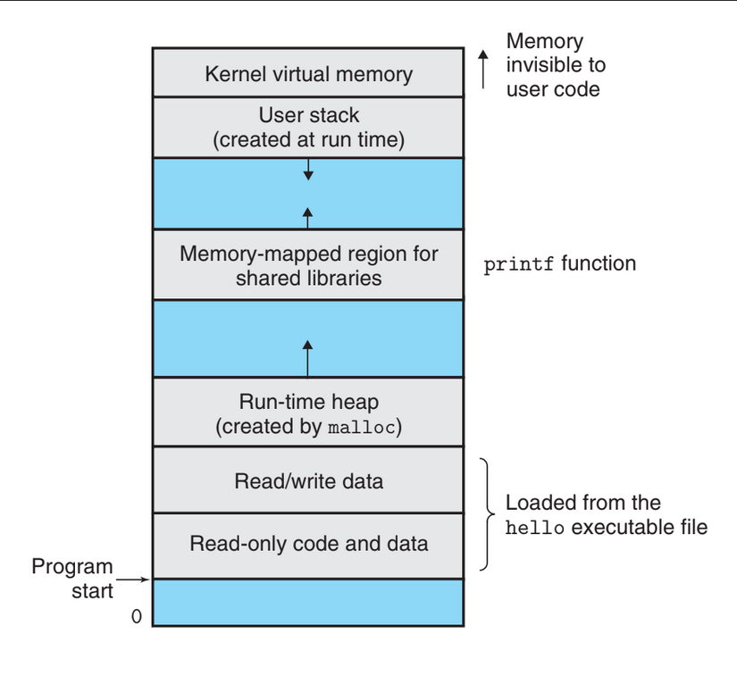

# Cosmic Monkey Part 2 

## Intro and Motivation

Having come up to speed on your C programming in the first part of the cosmic 
monkey project, you are now ready to move on to part 2. This is meant as an 
introduction to the PVDXos codebase, which you can see is quite complicated. 
This is not a comprehensive guide to working with PVDXos. However, by 
re-implementing cosmic monkey as an OS task, you will learn the overall 
structure and architecture of our operating system. 

## Tasks 

Tasks are the logical foundation of PVDXos. A task is a _single thread 
of execution with it own stack_. Recall the PVDXos architecture diagram: each 
box/thing on the diagram corresponds to a single task. 

Let's take a closer look at this definition. A "single thread of execution"
means a task is associated with some sequence of instructions, which a 
processor would execute one-by-one. Each instruction (usually) takes 1 cycle 
(one tick of the built-in clocks) to execute. If you've ever seen computer chips 
described in terms of "clock speed", or described by a measurement in MHz or 
GHz, these measurements refer to the number of cycles per second. 

Now, let's take a look at the "stack". Consider a typical computer program. 
Ideally, the instructions to be executed would be broken up into functions. 
Each function has local variables. Where are local variables stored? 

A specific area of computer memory is allocated to store those. This is the 
stack. Each function is allocated an area within the stack, called a 
"stack frame". The processor uses registers (global pointers-ish) to keep track 
of the current function's stack. The stack "grows downwards."



Consider the function: 

```
void foo(void *data) {

    // idk what this function does

}

int main(int argc, char **argv) {
    
    // prepare data
    foo(data) // call foo()
    // do more things 

    return 0
}
```

When a function is called 